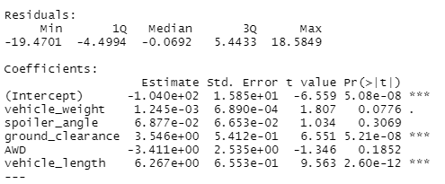
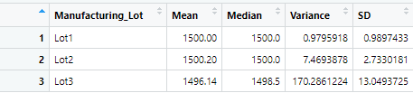
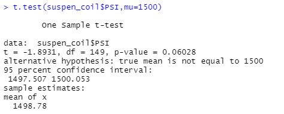
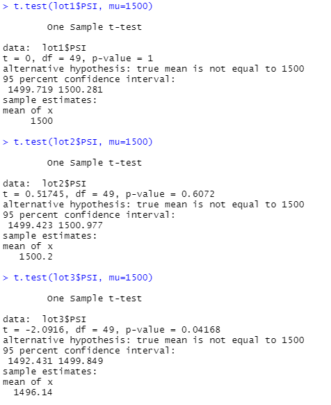

# MechaCar_Statistical_Analysis

## Linear Regression to Predict MPG

To understand if there is a relationship between vehicle weight, spoiler angle, ground clearance, AWD and vehicle length, and mpg of MechaCar prototypes we need to ask ourselves a few statistical questions, to come to a strong hypothesis.

With multiple linear regression model, we are establishing the following hypothesis:

We can set a null hypothesis to look for an outcome with no change:

- H0: The slope of the linear model is zero, or m = 0 (If there is no significant linear relationship, each dependent value would be determined by random chance and error. Therefore, our linear model would be a flat line with a slope of 0).

Then, establish an alternative hypothesis where there is change:

- Ha: The slope of the linear model is not zero, or m ≠ 0 
    (If there is significant linear relationship, each dependent value would not be determined by random chance and error. Therefore, our linear model would not be a flat line with a slope greater or lesser than 0).

How can we determine if there is non-random variance among our variables and coefficients in our dataset?

A variable's p-value will help understand the amount of variance to our mpg value, to help us better understand how each variable influences our hypothesis.

In this case, when we compare the p-value of the above image (5.35e-11) to the assumed significance level of 0.05, we can assert the slope of the linear model is not zero.

This model properly predicts mpg of MechaCar prototypes effectively because the r-squared is 0.7149 and indicates a strong positive linear relationship.

## Summary Stats on Suspention Coils

The design specifications for the MechaCar suspension coils dictate that the variance of the suspension coils must not exceed 100 pounds per square inch.

Each lot individually

The current manufacturing data partially meet this design specification for each lot separately. According to the results (Figure 2), it shows that Lot 1 and Lot 2 meet the design specification with a variance is 1.15 and 10.13 PSI respectively, and it is within requirements of not exceeding variance 100 PSI. Lot 3 does not meet the design specification, because of its variance of 220.01 PSI and that exceed the requirements variance of 100 PSI.

All lots

The current manufacturing data meet this design specification for all manufacturing lots in total. According to the results (Figure 4) shows that variance is 76.23 PSI, that is within requirements of not exceeding variance 100 PSI.

## T-Tests on Suspention Coils

Null Hypothesis:

- H0: There is no statistical difference between the suspension coil data set mean and its presumed population mean of 1,500 PSI.

Alternative Hypothesis:

- Ha: There is statistical difference between the suspension coil data set mean and its presumed population mean of 1,500 PSI.

Again, using the p-value we can find if there is a statistical difference between the observed sample mean and the presumed population mean to reject or fail to reject our null hypothesis.   

Looking at the images above, we can see that in all cases the p-value is above the assumed significance level of 0.05. Therefore, there is not enough evidence and we fail to reject the null hypothesis, meaning that the two means not statistically different.

## Study Design: MechaCar vs Competition

Potential Metric:

- A comparison of a single dependent variable exhaust system emissions means across a single independent variable transmission efficiency with multiple groups.

Null Hypothesis:

- H0: The means of exhaust system emissions of all groups are equal.

Alternative Hypothesis:

- Ha: One or more of the means of exhaust systems in the group is greater than the rest.

- Using a one-way Analysis of Variance (ANOVA) test we can study the means of a single dependent variable across a single independent variable with multiple groups.

- If we reject the null hypothesis, we can conclude that at least one of the means of exhaust system emissions is different from all other groups.

To accomplish this we would need data based on transmission efficiency data, exhaust system emissions data, and vehicle idetification. 

- The dependent variable would be numerical continuous, and normally distrubuted.

- The independent variables are categorical.

